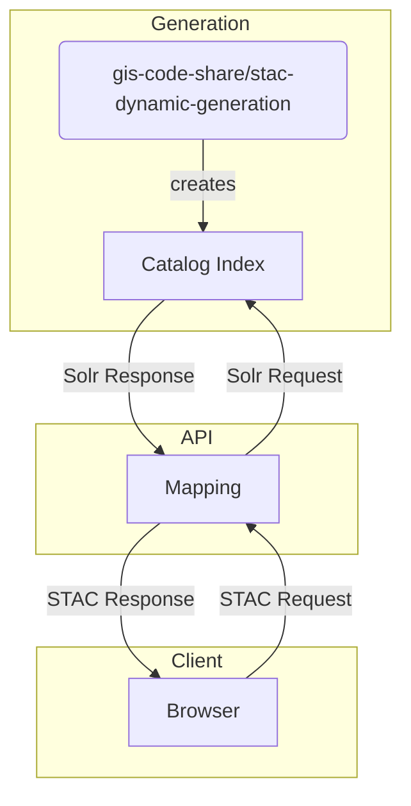

# stac-solr-fastapi
STAC API implementation using Python FastAPI and Apache Solr

# STAC API mit Lucene



## Routes
| Method    | Endpoint                                      | Response
| --------  | --------------------------------------------- |----------------------- |
| GET       | /                                             | Landing Page (Catatlog)|
| GET       | /conformance                                  | Conformance Classes    |
| GET       | /search                                       | Search Result (Items)  |
| POST      | /search                                       | Search Result (Items)  |
| GET       | /collections                                  | Collection List        |
| GET       | /collections/{collectionId}                   | Collection             |
| GET       | /collections/{collectionId}/items             | Item List              |
| GET       | /collections/{collectionId}/items/{itemId}    | Item                   |

## Request Mapping
Since SOLR requests do not apply to the STAC specification, the STAC API has to transform/map the requests to a valid STAC requests.
Example:
- SOLR Request:
    - GET solr_ip/suche/stac/kagis-catalog/search?&fq=collection:KAGIS_coll_elevation%20AND%20bbox:[46.512981,13.995059%20TO%2046.524014,14.035074]&fq=type:Feature
- STAC Request:
    - GET stac_ip/search?collection=KAGIS_coll_elevation&bbox=13.995059,46.512981,14.035074,46.524014

The python files main.py and [param_utils.py](param_utils.py) are responsible for mapping the incoming STAC Specification Requests to SOLR Requests.  

## Response Mapping
The script [response_mapping.py](helpers/response_mapping.py) and the config file [map.json](configuration/map.json) are responsible for the response mapping from SOLR responses to STAC responses.
The config file [map.json](configuration/map.json) specifies all request paths and how the response of this request is mapped to a valid STAC specification response.

### 1st Example: Landing Page
```json
{
    "paths": {
        "/": {
            "get": {
                "responses": {
                    "200": {
                        "response": ["response", "docs", 0, "json:json_string"]
                    }
                }
            }
        },
    }
}
```
In this case, the mapping for the get request to the endpoint "/" with statuscode 200 is defined.

The SOLR Response looks like this (example):
```json
{
  "response":
    {
        "numFound":1,
        "start":0,
        "numFoundExact":true,
        "docs":[
            {
                "uniqueid":"catalog_kagis-catalog",
                "id":"kagis-catalog",
                "type":"Catalog",
                "description":"\n#    KAGIS - ...",
                "_version_":1777405638838583296,
                "json_string":"{\"type\": \"Catalog\", [...] \"id\": \"kagis\"}]"
    }
}
```
The SOLR response is mapped by the STAC API using the map.json entry. The STAC response JSON is replaced by solrResponse["response"]["docs"][0]["json_string"]. The "json:" in the map.json identifies a json content string which is parsed to valid when returning the reponse.
The STAC response is exacly the json_string property from the json above and looks like this:
```json
{
    "type": "Catalog",
    "id": "kagis-catalog",
    "stac_version": "1.0.0",
    "description": "\n#    KAGIS - ...",
    "[...]": "[...]",
    "title": "KAGIS Katalog"
}
```
### 2nd Example: Search
```json
    "/search": {
        "get": {
            "responses": {
                "200": {
                    "start": "",
                    "numFoundExact": "",
                    "numberMatched": "numFound",
                    "features": ["list:features", "properties", "json:json_string"],
                    "numberReturned": "len:features"
                }
            }
        }
    }

```
For this response, several components are mapped and changed.
- "start" and "numFoundExact" from the SOLR response are not returned in the STAC response and are deleted (empty value in map json).
- "numFound" from the SOLR response is renamed to "numberMatched"
- The STAC response attribute "features" is set to the json_strings within solrResponse["features"]
- "numberReturned" returns the number of found items (the length of "features") -> if a mapping entry (like this one) refers to another mapping entry (like features), the entries have to be specified in this order!

## Error Handling

All errors are mapped to the required format, specified by the STAC API Specification. This happend in the script [errorHandler.py](helpers/errorHandler.py).
```json
{
    "code": "string",
    "description": "string"
}
```
Since the HTTP Error 422 is not caught by the HTTP Exception, this is handled by middleware in main.py.

## Testing
The script [test_main.py](test_main.py) defines test cases testing the API.
By running the command "pytest", the testing script is started. Optionally, a path can be specified to add an HTML report.
```bash
    pytest  --html-report=./tests/report.html
```
The test script requires generated STAC data in Solr (modify test_main accordingly). 
